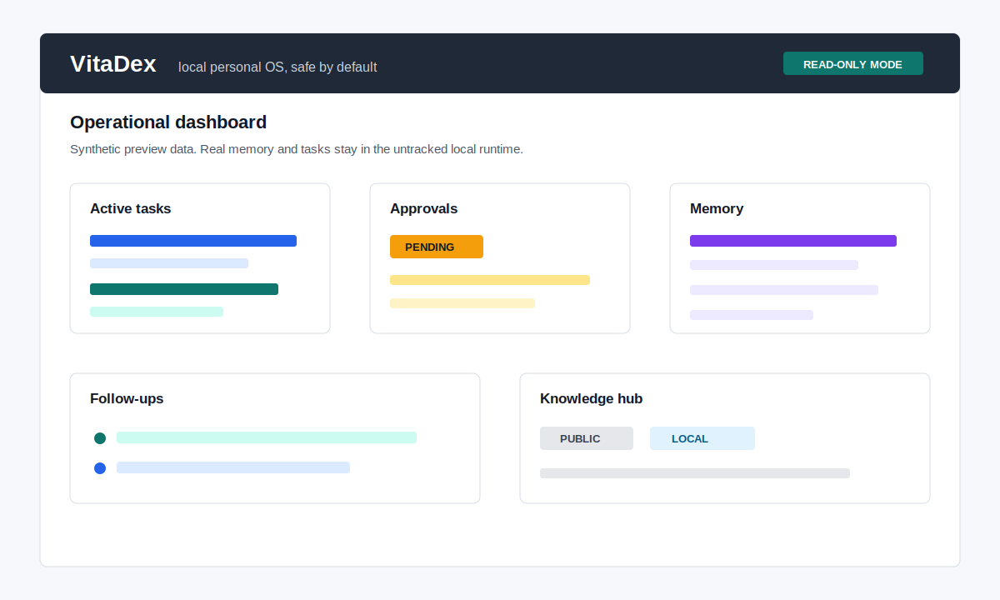

# VitaDex

[](https://github.com/DavideZanonArt/vitadex/actions/workflows/ci.yml)
[](https://github.com/DavideZanonArt/vitadex/actions/workflows/secret-scan.yml)
[](https://www.python.org/downloads/)
[](LICENSE)

VitaDex is a local-first personal OS for Codex.

It gives Codex durable local context: memory, tasks, approvals, workflows, documents, decisions, and follow-ups in one private filesystem-native runtime.

Codex should not wake up stateless every session. VitaDex keeps the operating state around your work while the open-source repository stays clean and publishable.

The public repository contains the product core. Your real memory, logs, user-specific configuration, and local runtime data stay outside version control.

Try the anonymous demo in under three minutes:

```bash
vitadex init
vitadex demo seed
vitadex dashboard
vitadex web
```



## Features

- Operational tasks with status, goal, constraints, assumptions, and next actions.
- Structured memory with review workflows, sensitivity levels, and local search.
- Approval queue for all external actions.
- Persistent follow-ups and audit logs.
- Generic asset tracking for renewals such as domains, subscriptions, licenses, contracts, and warranties.
- Read-only CLI and web dashboards.
- Exportable and reusable skills.
- Local Codex harness integration running in `dry_run` and `fail_closed` mode.

## Requirements

- Python 3.12+
- a Unix-like local environment or macOS
- no business credentials stored in the repository

## Installation

```bash
python3.12 -m venv .venv
source .venv/bin/activate
pip install -e ".[dev]"
cp .env.example .env.local
./scripts/bootstrap-local.sh
vitadex init
```

## Anonymous Demo

Use the demo seed to inspect VitaDex without adding personal data:

```bash
vitadex demo seed
vitadex dashboard
vitadex web
```

The demo creates one synthetic task, one public memory, one draft-only approval, and one follow-up. It is safe to inspect and safe to delete with your local runtime.

See `docs/demo.md` for expected output and troubleshooting.

## Secure Local Configuration

The public repository must not contain personal data. Always use an untracked local overlay:

```bash
cp .env.example .env.local
```

Configure at least these local paths:

- `VITADEX_STATE_ROOT`
- `VITADEX_DATA_DIR`
- `VITADEX_MEMORY_DIR`
- `VITADEX_LOG_DIR`
- `VITADEX_WORKSPACE_DIR`
- `VITADEX_DB_PATH`

Recommended example:

```env
VITADEX_STATE_ROOT=~/.vitadex
VITADEX_DATA_DIR=~/.vitadex/data
VITADEX_MEMORY_DIR=~/.vitadex/memory
VITADEX_LOG_DIR=~/.vitadex/logs
VITADEX_WORKSPACE_DIR=~/.vitadex/workspace
VITADEX_DB_PATH=~/.vitadex/data/vitadex.sqlite
```

Do not commit `.env.local`. The same rule applies to `memory/`, `housing/`, `workspace/`, `logs/`, the SQLite database, and any file containing personal content.

## Public vs Local

VitaDex is designed around a hard boundary:

```text
GitHub repository
  code, tests, docs, config, anonymous examples

Local runtime
  .env.local, memory, real tasks, logs, workspace, SQLite database
```

The public core can be published, forked, tested, and reviewed. The local runtime is where user-specific context lives. Do not copy data from the local runtime into pull requests, examples, issues, fixtures, screenshots, or docs.

## Quickstart

```bash
vitadex init
vitadex demo seed
vitadex memory add --type preference --area travel --text "I prefer road trips with reliable Wi-Fi."
vitadex task create --title "Prepare temporary apartment request" --area home --goal "Collect options and outreach drafts"
vitadex task plan <task_id>
vitadex task execute <task_id> --dry-run
vitadex approvals list
vitadex dashboard
vitadex web
vitadex codex status
```

## Security Model

Safe mode is enabled by default:

- browser runs in mock or search-plan mode
- Gmail creates drafts and does not send messages
- Calendar creates proposals instead of real events
- Drive uses mock local storage
- Telegram generates mock notifications
- filesystem access is limited to the configured scope
- payments, signatures, and legal commitments are forbidden

## Repository Model

The intended structure is:

- `public repo`: code, tests, documentation, anonymized examples, base configuration
- `local instance`: user profile, real memory, real tasks, runtime outputs, local overrides
- `Codex`: attached to the local instance, not to published data

## Main Structure

- `vitadex/`: Python implementation
- `tests/`: automated tests
- `config/`: versioned policies and defaults
- `docs/`: architecture, local setup, and integrations
- `examples/`: anonymous fixtures
- `templates/`: generic templates
- `workflows/`: documented workflows
- `examples/assets/`: anonymous asset tracking fixtures

## Included Skills

- `housing_search`
- `asset_reconciliation`
- `quote_request`
- `travel_planning`
- `appointment_booking`
- `document_request`
- `complaint_management`
- `purchase_research`
- `email_followup`
- `decision_matrix`
- `dashboard_digest`

## Codex Integration

`vitadex codex ...` binds a local task to a Codex thread. The core keeps tasks, memory, approvals, follow-ups, and audit logs; Codex owns the agent session and workspace changes.

The harness is intentionally conservative in the public release: default behavior is `dry_run` and `fail_closed`. Live execution is an integration boundary, not a requirement for trying the open-source core.

See `docs/future-openclaw-integration.md` and `vitadex/integrations/codex_harness/README.md`.
For the canonical local workflow, see `docs/codex-local-workflow.md`.
For core terms, see `docs/glossary.md`.

## Development

```bash
pytest
ruff check .
mypy vitadex
```

To add a skill:

1. Create `vitadex/skills/<skill>.py`.
2. Extend `Skill`.
3. Define `manifest`.
4. Implement `plan()` and `execute()`.
5. Register the skill in `vitadex/skills/__init__.py`.
6. Add workflow, templates, and tests.

## Contributions

Open issues or pull requests following `CONTRIBUTING.md`. PRs must not contain personal data, secrets, absolute local paths, or real examples traceable to actual people.

Good first contributions include docs improvements, anonymous fixtures, dashboard hardening, new dry-run skills, and tests for boundary behavior.

## Post-Publish Operations

See `docs/post-publish-checklist.md` and `RELEASE.md` for the GitHub and runtime steps to maintain after publishing.

## License

Vedi `LICENSE`.
